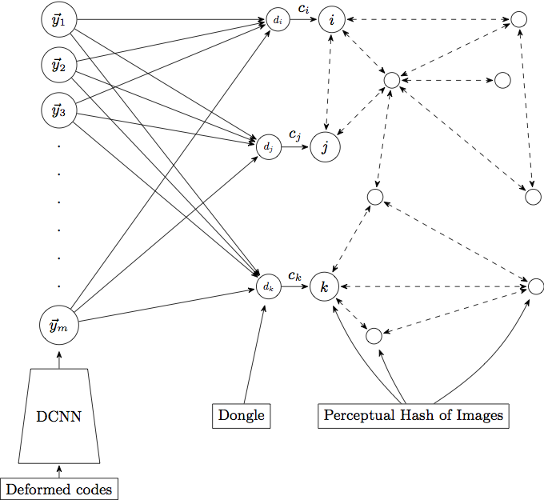

This project is the implementation of _Discovering Sematic Meaning with Unsupervised Learning_. The task is to break the captcha from [China Railway Official Website](http://www.12306.cn). 

We construct a graph with image count and co-occurrence information and run label propagation on it. The data flow and graph from a vertex's (image) view is illustrated below:

{:class="img-responsive"}
{:class="img-responsive"}

The detailed explanation of data flow and code files is [here](https://github.com/normanyahq/Break12306Captcha/blob/master/instructions/instruction.md).

