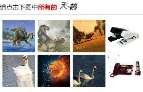

This project is the implementation of _Learning to Associate Words and Images Using a Large-scale Graph_. 

In this work, we develop an approach for unsupervised learning of associations between co-occurring perceptual events using a large graph. We applied this approach to suc- cessfully solve the image captcha of China’s railroad system: 

We leveraged the structure of presented data of a particular captcha system to construct an association graph of 6 million vertices, and linked these vertices based on co-occurrence information and feature similarity between pairs of images. 

The resulting system, using label propagation, solved captchas with 77% accuracy and an average response time of 2 seconds, a performance that is comparable to that of humans.

The detailed explanation of data flow and code files can be found [here](https://github.com/normanyahq/Break12306Captcha/blob/master/instructions/instruction.md).

Following are two captcha predictions:

