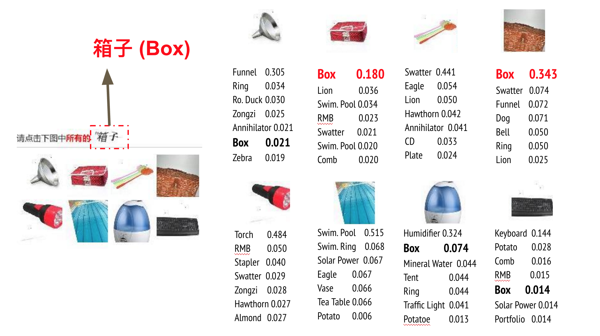
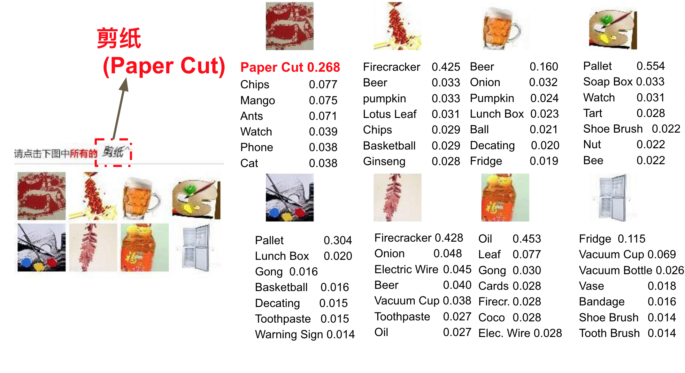

This project is the implementation of _Discovering Sematic Meaning with Unsupervised Learning_. The task is to break the captcha from [China Railway Official Website](http://www.12306.cn). 

We construct a graph with image count and co-occurrence information and run label propagation on it. The data flow and graph from a vertex's (image) view is illustrated below:

The detailed explanation of data flow and code files is [here](https://github.com/normanyahq/Break12306Captcha/blob/master/instructions/instruction.md).

Some example results are shown below:

[1] L.V.Ahn,M.Blum,N.J.Hopper,andJ.Langford,“CAPTCHA:Using hard AI problems for security,” in Proceedings of the 22nd International Conference on Theory and Applications of Cryptographic Techniques. Springer-Verlag, 2003, pp. 294–311.
[2] I. J. Goodfellow, Y. Bulatov, J. Ibarz, S. Arnoud, and V. Shet, “Multi- digit Number Recognition from Street View Imagery using Deep Con- volutional Neural Networks,” ArXiv e-prints, Dec 2013.
[3] V. Shet, “Are you a robot? Introducing “No CAPTCHA reCAPTCHA”,” Google, Dec 2014. [Online]. Available: https://security.googleblog.com/ 2014/12/are- you- robot- introducing- no- captcha.html
[4] J. Zhu, “China Railway Corporation: Scaling Online Sales for the Largest Railway in the World,” Pivotal, 2016. [Online]. Available: https://content.pivotal.io/case- studies/china- railway- corporation
[5] A. Krizhevsky, I. Sutskever, and G. E. Hinton, “Imagenet classification with deep convolutional neural networks,” in Advances in Neural In- formation Processing Systems 25. Curran Associates, Inc., 2012, pp. 1097–1105.
[6] X.Zhu,Z.Ghahramani,andJ.Lafferty,“Semi-supervisedlearningusing gaussian fields and harmonic functions,” in ICML, vol. 3, 2003, pp. 912– 919.
[7] E.Bursztein,S.Bethard,C.Fabry,J.C.Mitchell,andD.Jurafsky,“How good are humans at solving CAPTCHAs? a large scale evaluation,” in Proceedings of the 2010 IEEE Symposium on Security and Privacy, ser. SP ’10. Washington, DC, USA: IEEE Computer Society, 2010, pp. 399–413. [Online]. Available: http://dx.doi.org/10.1109/SP.2010.31
[8] S.Sivakorn,I.Polakis,andA.D.Keromytis,“Iamrobot:(deep)learning to break semantic image captchas,” in 2016 IEEE European Symposium on Security and Privacy (EuroS P), March 2016, pp. 388–403.
[9] A. Karpathy, G. Toderici, S. Shetty, T. Leung, R. Sukthankar, and L. Fei-Fei, “Large-scale video classification with convolutional neural networks,” in Proceedings of the IEEE Conference on Computer Vision and Pattern Recognition, ser. CVPR. Washington, DC, USA: IEEE Computer Society, 2014, pp. 1725–1732. [Online]. Available: http://dx.doi.org/10.1109/CVPR.2014.223
[10] K. Simonyan and A. Zisserman, “Two-stream convolutional networks for action recognition in videos,” in Advances in Neural Information Processing Systems 27, Z. Ghahramani, M. Welling, C. Cortes, N. D. Lawrence, and K. Q. Weinberger, Eds. Curran Associates, Inc., 2014, pp. 568–576.
[11] A. S. Razavian, H. Azizpour, J. Sullivan, and S. Carlsson, “CNN features off-the-shelf: An astounding baseline for recognition,” in Proceedings of the IEEE Conference on Computer Vision and Pattern Recognition Workshops, ser. CVPRW. Washington, DC, USA: IEEE Computer Society, 2014, pp. 512–519. [Online]. Available: http://dx.doi.org/10.1109/CVPRW.2014.131
[12] A. Babenko, A. Slesarev, A. Chigorin, and V. S. Lempitsky, “Neural codes for image retrieval,” CoRR, vol. abs/1404.1777, 2014.
[13] M. Oquab, L. Bottou, I. Laptev, and J. Sivic, “Learning and transferring mid-level image representations using convolutional neural networks,” in Proceedings of the IEEE conference on computer vision and pattern recognition, 2014, pp. 1717–1724.
[14] S. Bengio, J. Dean, D. Erhan, E. Ie, Q. V. Le, A. Rabinovich, J. Shlens, and Y. Singer, “Using web co-occurrence statistics for improving image categorization,” CoRR, vol. abs/1312.5697, 2013.
[15] E. Ising, “Beitrag zur theorie des ferromagnetismus,” Zeitschrift fu ̈r Physik, vol. 31, no. 1, pp. 253–258, 1925.
[16] X. Zhu, J. Lafferty, and R. Rosenfeld, Semi-supervised learning with
graphs. Carnegie Mellon University, language technologies institute, school of computer science, 2005.
[17] Y.Lecun,L.Bottou,Y.Bengio,andP.Haffner,“Gradient-basedlearning applied to document recognition,” Proceedings of the IEEE, vol. 86, no. 11, pp. 2278–2324, Nov 1998.
[18] E. Klinger and D. Starkweather. (2010) pHash: the open source perceptual hash library. [Online]. Available: http://www.phash.org
[19] F. Hu, G.-S. Xia, J. Hu, and L. Zhang, “Transferring deep convolutional
neural networks for the scene classification of high-resolution remote sensing imagery,” Remote Sensing, vol. 7, no. 11, pp. 14680–14707, Nov 2015.
[20] D. Bahdanau, K. Cho, and Y. Bengio, “Neural machine translation by jointly learning to align and translate,” CoRR, vol. abs/1409.0473, 2014.
[21] D.Bahdanau,J.Chorowski,D.Serdyuk,P.Brakel,andY.Bengio,“End- to-end attention-based large vocabulary speech recognition,” CoRR, vol.
abs/1508.04395, 2015.
[22] K. Gregor, I. Danihelka, A. Graves, and D. Wierstra, “DRAW:
A recurrent neural network for image generation,” CoRR, vol. abs/1502.04623, 2015. [Online]. Available: http://arxiv.org/abs/1502. 04623
[23] E. Mansimov, E. Parisotto, L. J. Ba, and R. Salakhutdinov, “Generating images from captions with attention,” CoRR, vol. abs/1511.02793, 2015. [Online]. Available: http://arxiv.org/abs/1511.02793
[24] B. Efron, Large-scale Inference: Empirical Bayes Methods for Estima- tion, Testing, and Prediction. Cambridge University Press, 2012, vol. 1.
[25] E. V. Clark, First Language Acquisition. Cambridge University Press,
2009.
[26] G. Kress, Learning to Write. Routledge Chapman Hall, 1993.
[27] P. Bloom, “Pre ́cis of How Children Learn the Meanings of Words,”
Behavioral and Brain Sciences, vol. 24, no. 06, pp. 1095–1103, 2001.
[28] X.WangandA.Gupta,“Unsupervisedlearningofvisualrepresentations using videos,” in The IEEE International Conference on Computer
Vision (ICCV), December 2015.

